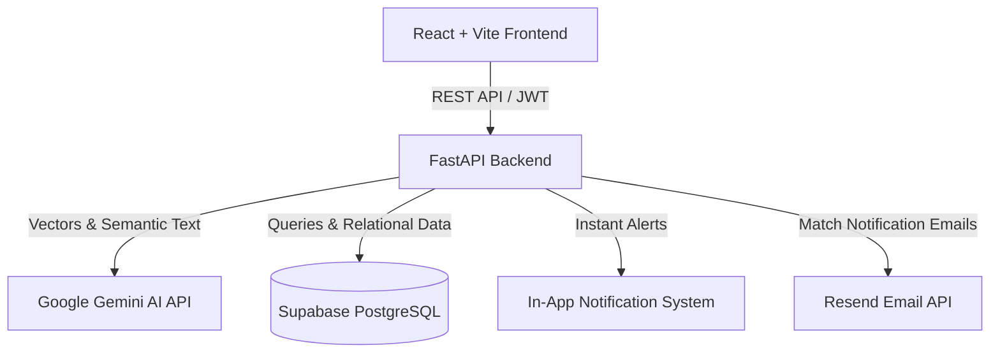

# 🪺 FindNest — AI-Powered Lost & Found Platform

[](https://fastapi.tiangolo.com/)
[](https://react.dev/)
[](https://vitejs.dev/)
[](https://tailwindcss.com/)
[](https://www.postgresql.org/)
[](https://supabase.com/)
[](https://ai.google.dev/)
[](https://resend.com/)

**FindNest** is an intelligent, high-performance web platform designed to reunite people with their lost belongings through state-of-the-art **AI multimodal semantic matching**, real-time **in-app notifications**, and automated **email alerts**.

---

## ✨ Key Features

- 🔍 **AI-Powered Semantic Matching**: Leverages Google Gemini (`gemini-embedding-2`) 768-dimensional multimodal embeddings combined with multi-factor scoring (Cosine similarity, Category matching, Location proximity, Date proximity).
- ⚡ **Instant Smart Match Discovery**: Lost item owners receive instant, ranked match suggestions with confidence percentages and visual match indicators.
- 🔔 **Multi-Channel Notifications**:
  - **In-App Notification Center**: Unread badge counter, live polling, instant mark-as-read, and direct links to matched items.
  - **Automated Email Alerts**: Powered by **Resend** or SMTP, delivering rich HTML emails whenever a high-confidence match (≥ 75%) is detected.
- 🔐 **Secure Authentication**: Robust JWT token-based auth with password hashing (bcrypt), role-based protection, and secure API endpoints.
- 📱 **Modern Glassmorphic UI**: Built with React 18, Vite, and TailwindCSS, featuring smooth micro-interactions, responsive mobile drawer navigation, dark/light themes, and accessible status tags.
- 🗄️ **Cloud & Local PostgreSQL Support**: Seamlessly connects to **Supabase PostgreSQL** in production with automated table creation, schema verification, and index optimization.

---

## 🏗️ Architecture Overview



---

## 🛠️ Tech Stack

### Frontend
- **Framework**: React 18 with Vite
- **Styling**: Tailwind CSS & Vanilla CSS Design Tokens
- **Icons**: Lucide React
- **HTTP Client**: Axios with automatic JWT interceptors

### Backend
- **Framework**: FastAPI (Python 3.12+)
- **ORM**: SQLAlchemy with Pydantic v2 schemas
- **Database**: PostgreSQL (Supabase Cloud or Local Postgres)
- **AI & Embeddings**: Google Gemini (`gemini-embedding-2`)
- **Email Service**: Resend API & Standard SMTP fallback
- **Authentication**: OAuth2 Password Flow with JWT (`python-jose`, `passlib`)

---

## 🚀 Quick Start Guide

### Prerequisites
- Node.js (v18+) & npm
- Python (3.11+)
- PostgreSQL or Supabase account

---

### 1. Clone the Repository
```bash
git clone https://github.com/gurucharangattupalli04/FindNest.git
cd FindNest
```

---

### 2. Backend Setup
```bash
cd backend
python -m venv venv

# Windows:
.\venv\Scripts\activate
# macOS/Linux:
# source venv/bin/activate

pip install -r requirements.txt
```

#### Configure Backend Environment
Copy the example environment file and fill in your credentials:
```bash
cp .env.example .env
```
Key variables in `backend/.env`:
- `DATABASE_URL`: Your Supabase or local PostgreSQL connection URI
- `JWT_SECRET_KEY`: A secure 32+ character secret
- `GEMINI_API_KEY`: Your Google AI Gemini API key
- `RESEND_API_KEY`: Your Resend API key (if using Resend for email alerts)
- `EMAIL_PROVIDER`: `resend` or `console`

#### Start the Backend
```bash
python run.py
```
Backend API will be live at: `http://localhost:8000`  
Swagger API Docs available at: `http://localhost:8000/docs`

---

### 3. Frontend Setup
From the repository root:
```bash
npm install
npm run dev
```
Frontend will be running at: `http://localhost:5173`

---

## 🧪 Testing

The repository contains a full regression and edge-case test suite:
```bash
cd backend
.\venv\Scripts\python.exe -m pytest -v
```
Includes tests for:
- Authentication & JWT validation
- Lost & Found item CRUD
- Image upload validation & storage
- Gemini embedding generation & fallback resilience
- Step 8 Smart Matching multi-factor scoring
- In-App & Resend Email notification delivery
- Edge cases (null inputs, duplicate items, boundary dates)

---

## 🔒 Security Best Practices
- **Zero Secret Commits**: Sensitive credentials (`.env`, private keys, secrets) are strictly ignored in `.gitignore`.
- **API Protection**: All protected endpoints require valid Bearer JWT tokens.
- **SQL Injection Prevention**: Built entirely with parameterized SQLAlchemy ORM queries.
- **Input Sanitization**: Pydantic models validate all incoming payloads.

---

## 📄 License
This project is licensed under the MIT License.
